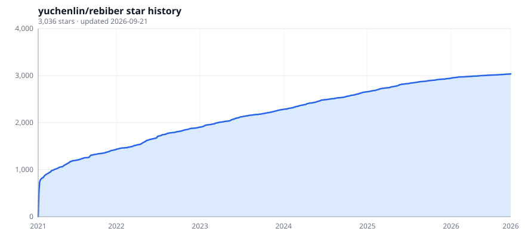
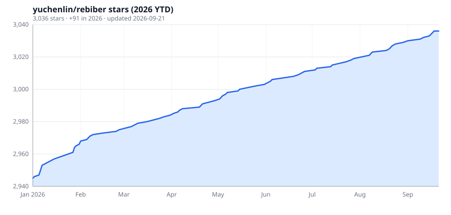

# Rebiber

Replace unofficial / arXiv BibTeX entries with official [DBLP](https://dblp.org/) or [ACL Anthology](https://aclanthology.org/) records. Cite keys are kept.

[Web demo](https://huggingface.co/spaces/yuchenlin/Rebiber) · [Colab](https://colab.research.google.com/drive/12oQcLs25CFjI4evsFlWfKD1DfTEiqyCN?usp=sharing)

Install **from GitHub only**. We do not publish or support PyPI (`pip install rebiber` is a 2021 1.1.3 release).

## Install

```bash
uv tool install git+https://github.com/yuchenlin/rebiber
# or
pip install "rebiber @ git+https://github.com/yuchenlin/rebiber"
```

Develop from a checkout:

```bash
git clone https://github.com/yuchenlin/rebiber.git && cd rebiber
uv sync --extra dev          # or: pip install -e ".[dev]"
uv run pytest
```

## Usage

Omitting `-o` overwrites each `-i` file. Start with `--dry-run`.

```bash
rebiber -i refs.bib --dry-run
rebiber -i refs.bib --dry-run --report changes.txt
rebiber -i refs.bib -o refs.official.bib
rebiber -i refs.bib --used-in paper.tex appendix.tex
rebiber -i refs.bib --live-lookup          # opt-in DBLP search after a local miss
rebiber -i *.bib -o ./normalized/
rebiber -i refs.bib --format-only -o pretty.bib
rebiber -i refs.bib --keep author,title,booktitle,journal,year,volume,number,pages,doi --protect-titles
```

Examples: [`examples/input.bib`](examples/input.bib) → [`examples/output.bib`](examples/output.bib).

| Flag | Default | Meaning |
| --- | --- | --- |
| `-i` | required | One or more `.bib` files |
| `-o` | in place | Output file, or a directory if `-i` has multiple files |
| `--dry-run` | off | Print the change report; do not write `.bib` |
| `--report PATH` | — | Also write the change report to a file |
| `--used-in TEX …` | all keys | Only *replace* keys cited in these files (`\cite` / `\citep` / `\citet` / `\citealp` / `\citeyear` / `\nocite`). Unused keys are still pretty-printed and still affected by `-r` / `-s` / `-st` / `-d` |
| `--live-lookup` | off | On a local miss, search DBLP by title (max 5 hits). Same author/title guards. Respect [DBLP rate limits](https://dblp.org/faq/How+to+use+the+dblp+search+API.html) |
| `--keep FIELDS` | keep all | Allowlist of fields (`ID` / `ENTRYTYPE` always kept) |
| `--protect-titles` | off | Brace acronyms in titles (`BERT`, `GPT-2`, …) |
| `--format-only` | off | Pretty-print only; no DB / DBLP / arXiv rewrite |
| `--no-check-authors` | off | Skip last-name overlap (empty authors still do not match) |
| `-r` | none | Drop fields, e.g. `-r url,biburl,timestamp` |
| `-s True` | `False` | Shorten venues via [`rebiber/abbr.tsv`](rebiber/abbr.tsv) |
| `-d False` | `True` | Keep duplicate cite keys |
| `-st True` | `False` | Sort entries by cite key |
| `-l` / `-a` | packaged | Custom `bib_list.txt` / `abbr.tsv` |
| `-u` | — | Refresh packaged dumps from GitHub `main` |
| `-v` | — | Print version |

Leftover unofficial arXiv entries may still query the arXiv API for year / `primaryClass`. Use `--format-only` for a fully offline run.

## Matching

- **Authors.** A title hit converts only if the first-author last names match **or** at least two last names overlap. Empty/missing authors never match (including with `--no-check-authors`). Trailing `et al.` / `et.al.` / `and others` are stripped.
- **Titles.** Digit-preserving key first (`16x16` ≠ `32x32`), then the letters-only key used by older dumps.
- **Live DBLP.** Prefers a published (non-arXiv/CoRR) hit; skips if several published hits remain. Digit keys must agree.
- **eprint.** If the input has an arXiv id and the official record does not, it is copied onto the replacement (local dump and live).
- **ArXiv form.** Unofficial preprints become `@misc` with `eprint` / `archivePrefix` / `primaryClass`. Already-published papers are not rewritten because an abstract mentions arXiv.
- **Broken entries.** Unparsed or unclosed records are kept, not dropped.

Build a dump JSON:

```bash
uv run python -m rebiber.bib2json -i path/to/conf.bib -o path/to/conf.json
```

## Example

```bib
@article{lin2020birds,
  title={Birds have four legs?! NumerSense: Probing Numerical Commonsense Knowledge of Pre-trained Language Models},
  author={Lin, Bill Yuchen and Lee, Seyeon and Khanna, Rahul and Ren, Xiang},
  journal={arXiv preprint arXiv:2005.00683},
  year={2020}
}
```

becomes the official EMNLP 2020 `@inproceedings` (same cite key), with anthology URL and DOI.

## Supported venues

Toggle files in [`rebiber/bib_list.txt`](rebiber/bib_list.txt). ACL Anthology includes *CL main conferences **and** workshops. Other dumps are **main tracks only** (no CVPR/ICCV workshops).

A monthly Action opens a PR with fresh DBLP + anthology data. Years below are what is **in this repo**, not “whatever DBLP has tomorrow.”

**Kept current** (monthly job + recent dumps)

| Venue | Years |
| --- | --- |
| ACL Anthology | current (split `acl_1/2/3.json`) |
| AAAI | 2010–2026 |
| ACCV | 2022, 2024 |
| AISTATS | 2013–2025 |
| BMVC | 2010–2024 |
| CHI | 2010–2026 |
| CVPR | 2000–2025 |
| ECCV | 2022, 2024 |
| ICASSP | 2015–2025 |
| ICCV | odd years 2003–2025 |
| ICLR | 2013–2025 |
| ICML | 2000–2025 |
| IJCAI | 2011, 2013, 2015–2025 |
| INTERSPEECH | 2016–2025 |
| KDD | 2010–2026 |
| ICRA / IROS | 2020–2025 (main) |
| RSS / CoRL | 2020–2024 (main) |
| JMLR | 2020–2026 |
| TMLR | 2022–2026 |
| WACV | 2022–2026 |
| MLSys | 2019–2025 |
| MICCAI | 2022–2025 (main) |
| NeurIPS | 2000–2025 |
| SIGIR | 2010–2026 |
| UAI | 2010–2025 |
| WWW | 2001–2026 |

**Not in the index:** COLM (empty DBLP toc). ICLR/ICML/CVPR 2026, RSS/CoRL 2025, ECCV 2026 — not on DBLP yet.

**Historical (frozen ~2020):** ALENEX, ASONAM, BigData, CIDR, CIKM, COLT, MM, RecSys, SDM, SIGMOD (through 2022; later years are PACMMOD), SODA, STOC, WSDM.

Thanks to [Anton Tsitsulin](http://tsitsul.in/) for the original dump collection.

## Adding a venue

```bash
uv run python -m rebiber.download_dblp --confs iclr --start-year 2026
```

That writes `rebiber/data/{conf}{year}.bib.json` and appends `bib_list.txt` when needed. PRs welcome.

## Star history

In-repo SVGs, refreshed weekly from the GitHub API (no third-party token).





## Contact

[billyuchenlin@gmail.com](mailto:billyuchenlin@gmail.com) · [i@yuchenlin.xyz](mailto:i@yuchenlin.xyz) · [GitHub issues](https://github.com/yuchenlin/rebiber/issues)
